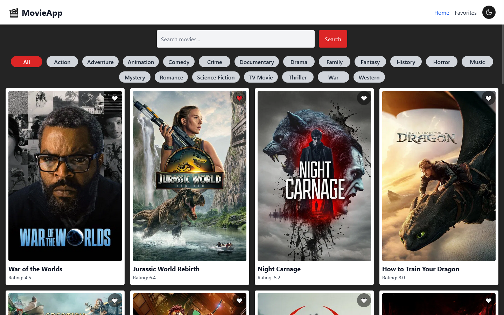
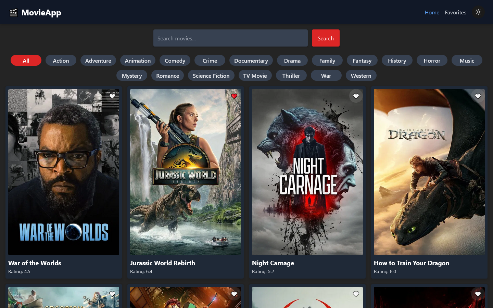
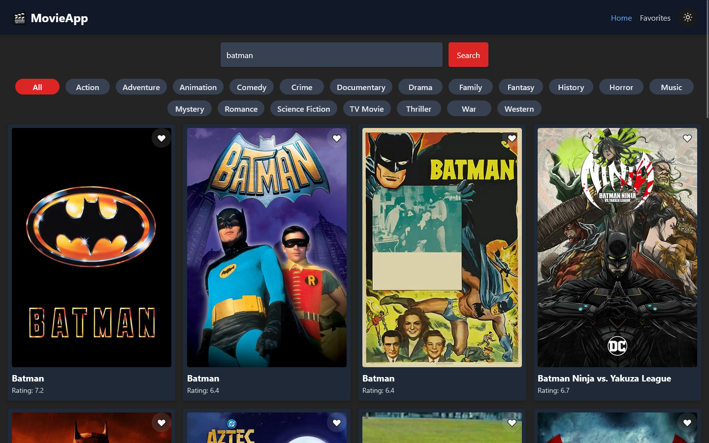
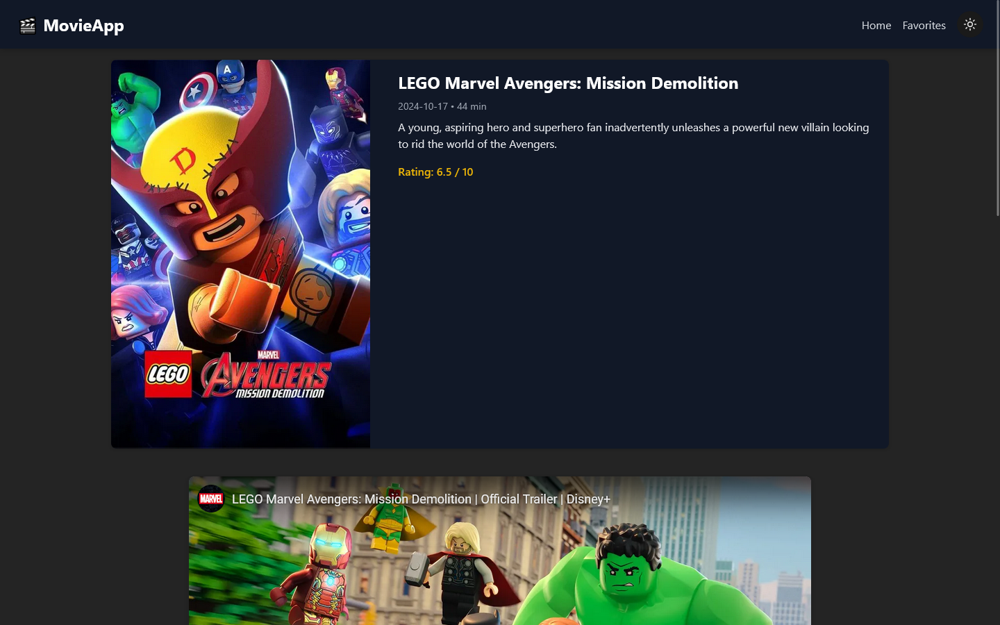
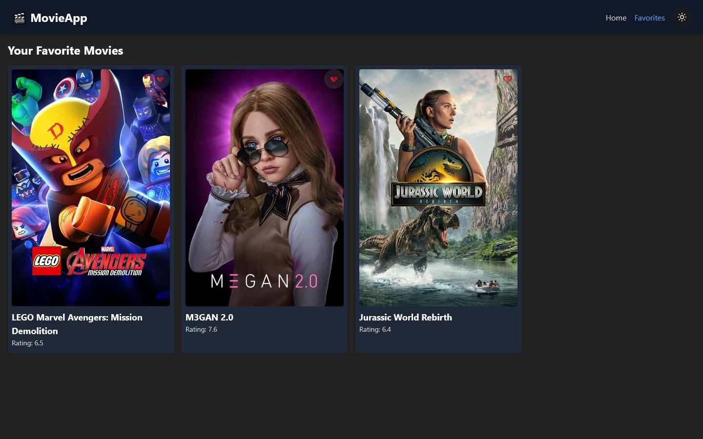
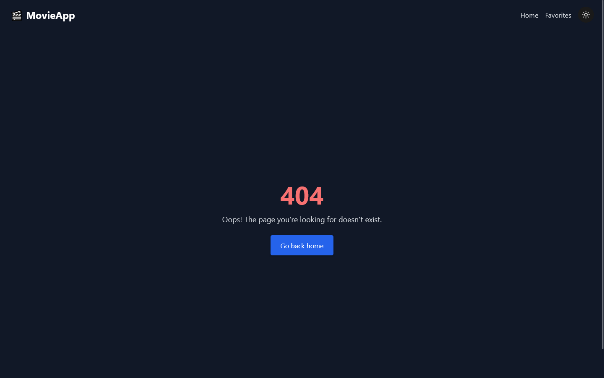

# 🎬 MovieApp

A modern React application for browsing, searching, and saving your favorite movies using the [TMDB API](https://www.themoviedb.org/).  
Built with **React**, **Vite**, **Tailwind CSS**, **Framer Motion**, and fully responsive with dark mode support.

🚀 **Live Demo:** https://movie-app-gamma-sand.vercel.app/

---

## ✨ Features

- 🔍 **Search Movies** – Find films by title via TMDB API
- 📄 **Movie Details** – View trailers, cast, and similar movies
- ❤️ **Favorites System** – Save and manage your favorite films (localStorage)
- 🌙 **Dark / Light Mode** – Persistent theme toggle
- 📱 **Responsive Design** – Works on mobile, tablet, and desktop
- 🎭 **Smooth Animations** – Powered by Framer Motion
- 🖼 **Lazy Loading Images** – Faster page loading
- ⚠ **Custom 404 Page** – Friendly not-found page

---

## 📸 Screenshots

| Light Mode | Dark Mode |
|------------|-----------|
|  |  |

### Search Results


### Movie Details



### Favorites


### NotFound


---

## 🎥 Demo (GIF)


## 🛠 Tech Stack

- **React 18** + **Vite**
- **Tailwind CSS**
- **Framer Motion**
- **React Router DOM**
- **TMDB API**
- **LocalStorage** for favorites

---

## ⚡ Getting Started

### 1. Clone the repository
```bash
git clone https://github.com/Vnill125/appfilm.git
cd appfilm
```

### 2. Install dependencies
```bash
npm install
```

### 3. Set up environment variables
Create a .env file in the root with your TMDB API key:
```env
VITE_TMDB_API_KEY=your_api_key_here
```

### 4. Run locally
```bash
npm run dev
```


📦 Build for production
```bash
npm run build
```

🌍 Deployment

This app is optimized for deployment on Vercel.
Simply connect your GitHub repo to Vercel, add your .env variable in project settings, and deploy.

📄 License

This project is licensed under the MIT License – feel free to use it for learning or personal projects.

💡 Author: Vnill125
If you like this project, consider giving it a ⭐ on GitHub!
